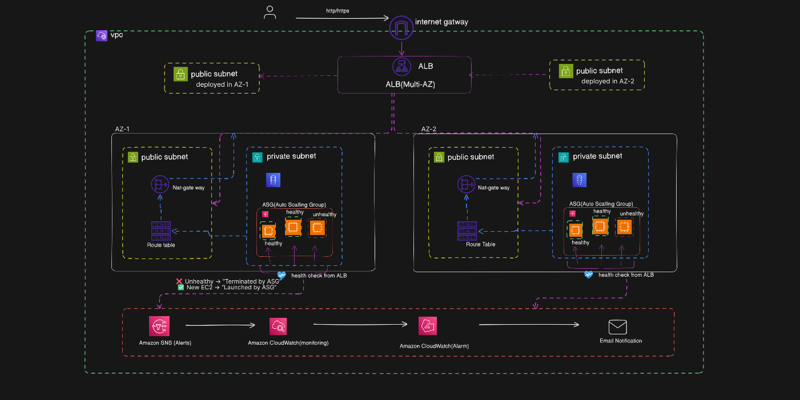
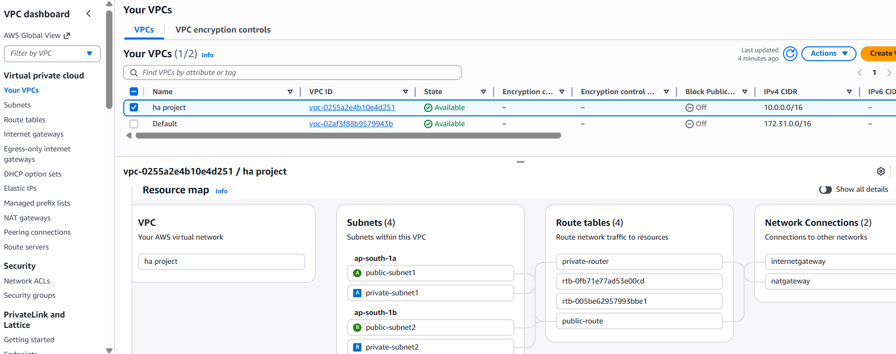
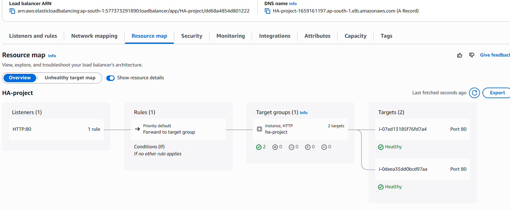
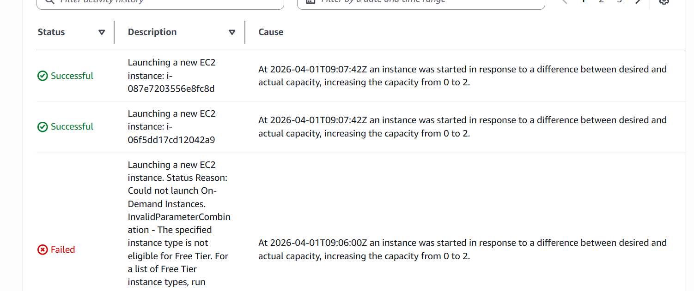
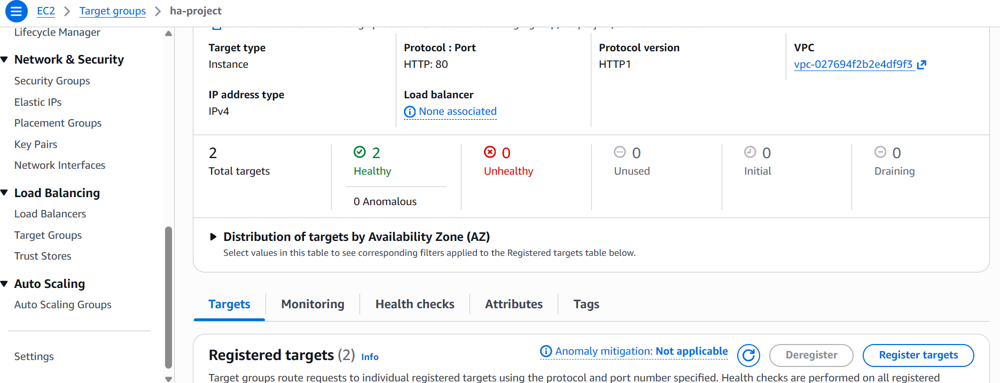
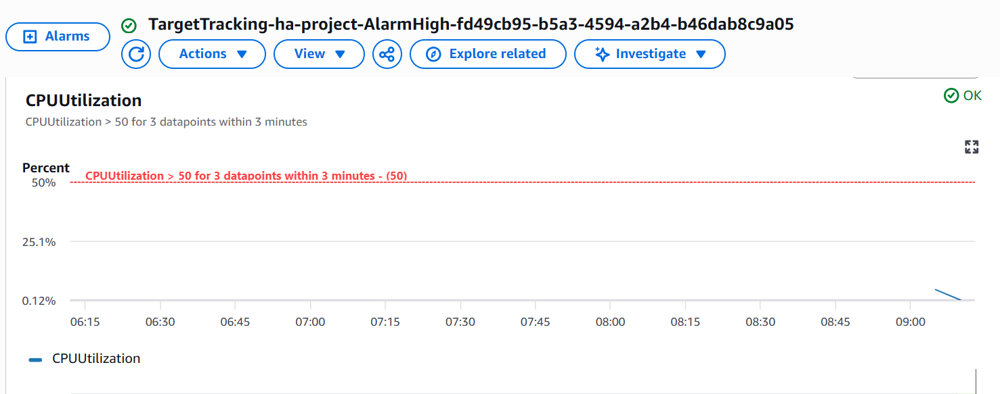

# AWS High Availability Architecture (Auto Scaling + Load Balancer)

## Project Overview

This project demonstrates a highly available and scalable architecture on AWS using core networking and compute services. The system is designed to ensure fault tolerance, load distribution, and automatic scaling across multiple Availability Zones.

---

## Architecture Components

* Virtual Private Cloud (VPC)
* Public Subnets (2 Availability Zones)
* Private Subnets (2 Availability Zones)
* Internet Gateway
* NAT Gateway
* Application Load Balancer (ALB)
* Auto Scaling Group (ASG)
* EC2 Instances (Private Subnets)
* CloudWatch Monitoring

---

## Architecture Diagram



---

## Implementation Steps

### 1. VPC and Networking

* Created a VPC with CIDR block: `10.0.0.0/16`
* Created four subnets:

  * Public Subnet (AZ1)
  * Public Subnet (AZ2)
  * Private Subnet (AZ1)
  * Private Subnet (AZ2)
* Attached Internet Gateway to the VPC
* Created NAT Gateway for private subnet internet access
* Configured route tables:

  * Public subnets routed to Internet Gateway
  * Private subnets routed to NAT Gateway

---

### 2. EC2 and Launch Template

* Created a Launch Template with:

  * AMI: Ubuntu
  * Instance Type: `t3.micro`
  * User Data Script:

```bash
#!/bin/bash
apt update -y
apt install apache2 -y
systemctl start apache2
systemctl enable apache2
echo "Hello from Private EC2" > /var/www/html/index.html
```

---

### 3. Load Balancer Configuration

* Created an Application Load Balancer
* Attached to public subnets across two Availability Zones
* Created a Target Group
* Configured health checks (HTTP, port 80, path `/`)

---

### 4. Auto Scaling Group

* Created an Auto Scaling Group using the launch template
* Selected private subnets in multiple Availability Zones
* Set desired capacity to 2
* Attached Auto Scaling Group to the target group

---

### 5. Auto Scaling Policy

* Configured target tracking scaling policy
* Metric: CPU Utilization
* Target value: 50%

---

### 6. Monitoring and Testing

* Used CloudWatch for monitoring EC2 metrics
* Auto Scaling automatically created alarms
* Simulated load using:

```bash
stress --cpu 4 --timeout 300
```

---

## Results

* High availability achieved across multiple Availability Zones
* Load distributed via Application Load Balancer
* Automatic scaling triggered based on CPU utilization
* Fault tolerance validated by replacing instances automatically

---

## Screenshots

* Vpc network Configuration
   
  
* Load Balancer Setup
  
  
* Auto Scaling Group Activity
   
  
* Instance Health-Check (target group)  
    
  
* CloudWatch Metrics
   
---

## Key Learnings

* VPC networking and subnet design
* Public vs private architecture
* Load balancing concepts
* Auto Scaling configuration
* CloudWatch monitoring
* High availability architecture design

---

## Conclusion

This project demonstrates how to build a scalable, fault-tolerant, and highly available infrastructure on AWS using industry-standard best practices.

---

## Author

Sapna Kumari
